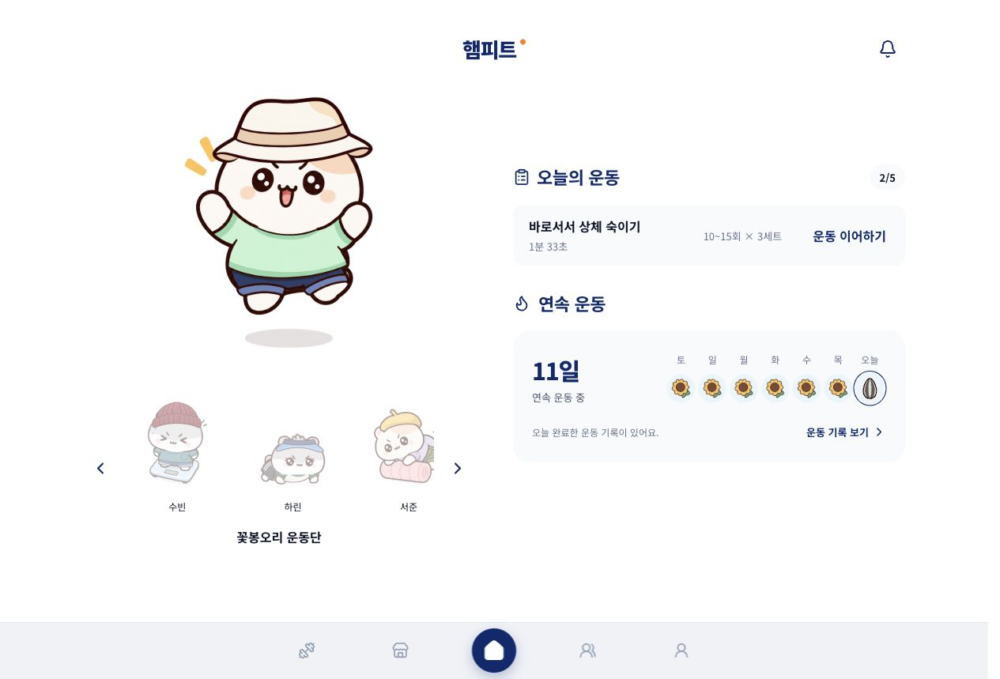
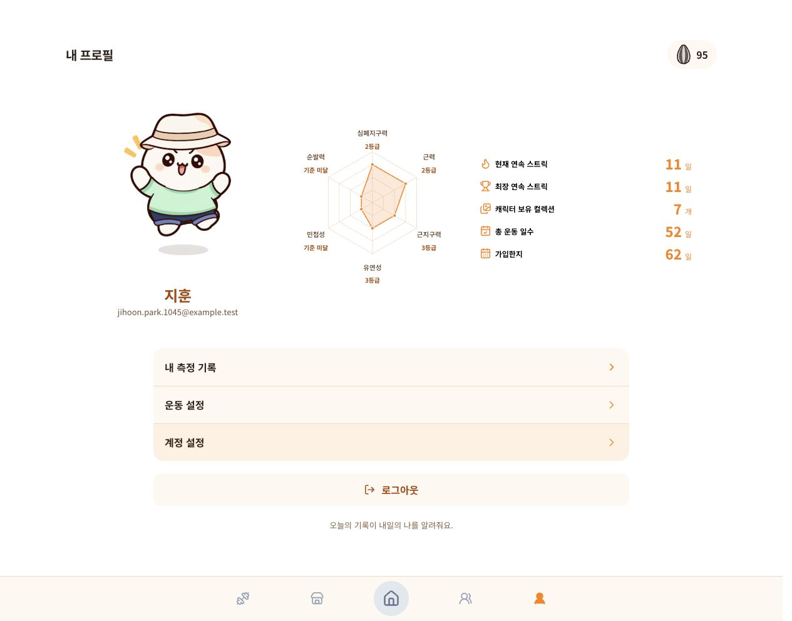
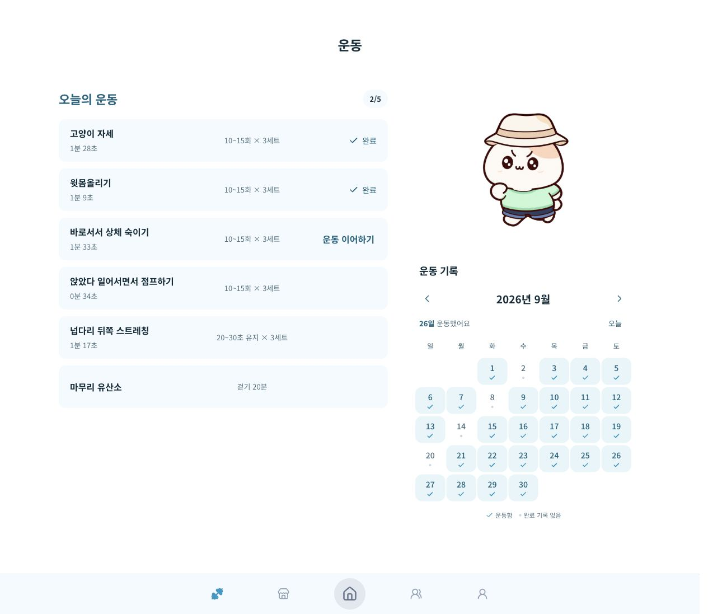
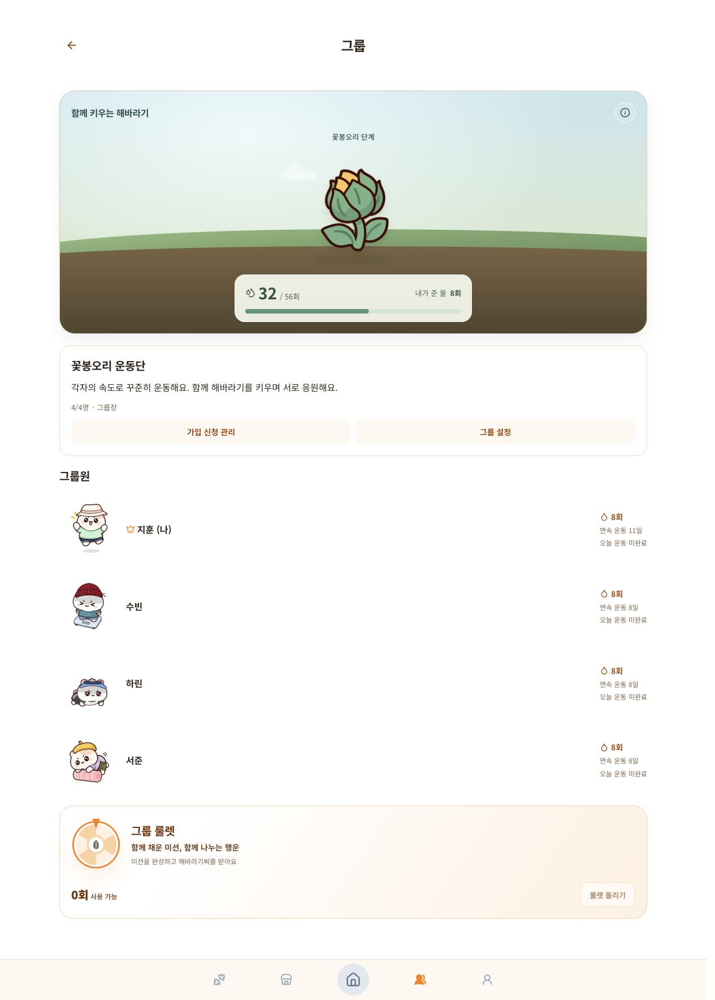
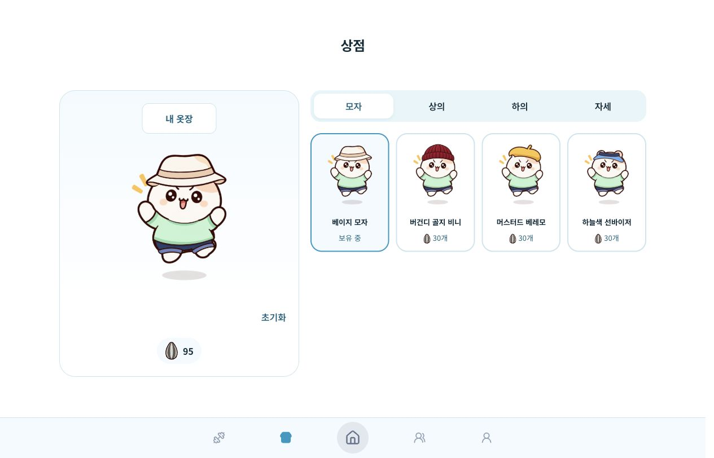

<div align="center">

<p>
  
  &nbsp;
  
  &nbsp;
  
  &nbsp;
  
</p>

# 🐹 Ham Fit · 햄피트

**내 체력에 맞는 운동을 찾고, 햄스터와 함께 꾸준한 운동 습관을 만들어 가세요.**

국민체력100 측정 기록을 바탕으로 운동 루틴을 추천하고,<br />
운동 기록·그룹 미션·캐릭터 꾸미기를 한곳에서 제공하는 웹 애플리케이션입니다.

    

[서비스 보기](https://ham-fit.vercel.app) · [빠른 시작](#-빠른-시작) · [백엔드](backend/README.md) · [프론트엔드](frontend/README.md) · [데이터 분석](data-analysis/README.md) · [기여하기](#-기여하기)

</div>

캐릭터와 함께 오늘의 운동을 이어 하고, 그룹원들의 모습과 최근 운동 습관을 한눈에 확인합니다.

<p align="center">
  <a href="docs/screenshots/home.jpg"></a>
</p>

> 아래 화면은 2026년 10월 2일 [운영 배포](https://ham-fit.vercel.app)에서 시연용으로 준비된 계정으로 직접 촬영했습니다. 이미지를 클릭하면 원본 캡처를 볼 수 있습니다.

## ✨ 주요 기능

| 기능               | 설명                                                                                                |
| ------------------ | --------------------------------------------------------------------------------------------------- |
| 체력 기록과 리포트 | 국민체력100 결과 직접 입력, 사진 추출 후 확인·저장, 성인 간이측정, 기록 수정·삭제와 6축 체력 그래프 |
| 맞춤 운동 루틴     | 체력 평가·연령·운동 목적·운동량·보유 도구·최근 운동 기록을 반영한 당일 루틴과 유산소 권장량         |
| 운동 수행과 기록   | 영상별 진행 저장, 이어하기, 주간·월간 달력, 날짜별 운동 기록과 다시보기                             |
| 함께하는 운동      | 최대 5명 그룹, 초대 코드와 가입 신청, 그룹 미션·물 주기·기여도·룰렛                                 |
| 운동 보상과 꾸미기 | 해바라기씨 재화, 하루 루틴 완료 보상, 개인 연속 운동 룰렛, 햄돌이·햄콩이와 코디·상점·옷장           |
| 계정과 개인 설정   | 이메일 로그인, 닉네임·생년월일·계정 정보 변경, 운동 설정, 알림과 회원 탈퇴                          |

현재 추천 대상 연령은 만 13–64세이며 성인 간이측정은 만 19–64세를 지원합니다. 사진 추출에는 별도 서버 설정이 필요합니다. 간이측정과 참고 평가는 정식 국민체력100 인증을 부여하지 않습니다.

### 내 체력을 알고, 변화를 기록해요

국민체력100 결과를 직접 입력하거나 사진으로 불러오고, 성인 간이측정으로 체력을 기록합니다. 프로필에서는 최근 측정의 6축 체력 그래프와 운동 일수·연속 운동·캐릭터 컬렉션을 함께 살펴볼 수 있습니다.

<p align="center">
  <a href="docs/screenshots/profile.jpg"></a>
</p>

### 오늘의 운동을 내 속도로 이어 가요

체력·운동 목적·운동량·보유 도구를 반영한 루틴에서 운동별 처방과 진행 상태를 확인합니다. 중단한 운동은 이어 하고, 주간·월간 달력으로 쌓인 운동 기록을 돌아봅니다. 화면에는 오늘 운동 2개 완료와 9월 운동 기록이 표시되어 있습니다.

<p align="center">
  <a href="docs/screenshots/workout.jpg"></a>
</p>

### 함께 운동하며 해바라기를 키워요

그룹에 가입해 서로의 캐릭터와 운동 현황을 확인하고 해바라기 미션을 진행합니다. 누적 물 주기와 개인 기여도가 화면에 표시되며, 미션을 완성하면 그룹 룰렛으로 이어집니다.

<p align="center">
  <a href="docs/screenshots/group-mission.jpg"></a>
</p>

### 운동의 보상으로 나만의 햄스터를 꾸며요

운동으로 모은 해바라기씨를 상점에서 사용하고, 모자·상의·하의·자세를 조합해 대표 캐릭터를 꾸밉니다. 코디 미리보기에서 원하는 조합을 확인하고 보유한 아이템은 옷장에서 다시 꺼내 입습니다.

<p align="center">
  <a href="docs/screenshots/shop.jpg"></a>
</p>

## 🧩 프로젝트 구성

```text
Ham-Fit/
├── backend/          # NestJS API, 인증·측정·루틴·그룹·보상, Prisma
├── frontend/         # Next.js 웹 UI, 운동 플레이어·체력 리포트·캐릭터
├── data-analysis/    # 데이터 수집·전처리 노트북, Python 추천 알고리즘
├── avatar-manager/   # 의상 이미지·배치 편집과 프론트 정적 자산 내보내기
└── CONTRIBUTING.md   # 커밋 메시지와 브랜치 이름 규칙
```

브라우저는 API로 사용자 데이터와 운동 진행을 저장합니다. 백엔드는 `data-analysis/src/recommendation_v2.py`와 전처리 CSV를 직접 읽어 추천을 생성하고 결과를 PostgreSQL에 보관합니다. 햄스터 의상 이미지는 프론트엔드의 정적 자산으로 제공합니다.

| 영역        | 기술                                                         | 상세 안내                                            |
| ----------- | ------------------------------------------------------------ | ---------------------------------------------------- |
| 프론트엔드  | Next.js 16, React 19, TypeScript, Tailwind CSS 4, Playwright | [frontend/README.md](frontend/README.md)             |
| 백엔드      | NestJS 12, TypeScript ESM, Prisma 7, PostgreSQL, Vitest      | [backend/README.md](backend/README.md)               |
| 데이터 분석 | Python, NumPy, pandas, Jupyter                               | [data-analysis/README.md](data-analysis/README.md)   |
| 캐릭터 도구 | Next.js 기반 로컬 에디터                                     | [avatar-manager/README.md](avatar-manager/README.md) |

## 🚀 빠른 시작

### 준비물

- Node.js: 백엔드 지원 범위는 `^24.15.0 || >=26.0.0`이며 `backend/.nvmrc`는 24를 지정합니다.
- npm과 PostgreSQL 17: 아래 로컬 DB 도우미를 쓰려면 `initdb`, `pg_ctl`이 PATH에 있어야 합니다.
- Python 3.9 이상: 신규 운동 루틴 추천에 필요합니다.
- 각 디렉토리에서 의존성을 설치합니다. 루트에는 통합 npm 실행 명령이 없습니다.

```bash
git clone https://github.com/r3j0/Ham-Fit.git
cd Ham-Fit
```

### 1. 백엔드 실행

새 체크아웃에서 로컬 PostgreSQL 도우미를 사용하는 예시입니다.

```bash
cd backend
nvm use
npm ci
npm run db:local:start
npm run auth:secret
npm run db:migrate:deploy

python3 -m venv .local/recommendation-venv
.local/recommendation-venv/bin/python -m pip install -r requirements-recommendation.txt
export RECOMMENDATION_PYTHON="$PWD/.local/recommendation-venv/bin/python"

npm run start:dev
```

DB 도우미는 개발·테스트 DB와 접속 설정이 담긴 `.env`를 생성합니다. 기존 `.env`가 있으면 보존하므로 실제 DB 접속 정보가 맞는지 확인하세요. 이미 준비한 PostgreSQL을 사용하는 절차와 선택 기능 설정은 [백엔드 안내](backend/README.md)를 따릅니다.

### 2. 프론트엔드 실행

별도 터미널에서 저장소 루트를 기준으로 실행합니다. 환경 파일 복사는 새 체크아웃에서 한 번만 진행합니다.

```bash
cd frontend
npm ci
cp .env.example .env.local
npm run dev
```

| 접속 주소                                   | 용도                              |
| ------------------------------------------- | --------------------------------- |
| `http://localhost:3000`                     | 웹 애플리케이션                   |
| `http://localhost:3001/api/v1/health`       | API 프로세스 상태                 |
| `http://localhost:3001/api/v1/health/ready` | DB·필수 스키마·카탈로그 준비 상태 |

프론트 API 기본 주소는 `http://localhost:3001/api/v1`입니다. 당일 운동 루틴은 별도 `/api/v2/workout-routines` 계약을 사용합니다. 회원가입 후 체력 기록과 운동 목적을 저장하면 맞춤 루틴을 시작할 수 있습니다.

## 📚 문서 안내

- **API와 데이터**: [인증](backend/docs/auth-api.md), [측정 기록](backend/docs/measurements-api.md), [체력 평가](backend/docs/measurement-evaluation-api.md), [운동 루틴](backend/docs/recommendations/routines-api.md)
- **그룹과 보상**: [그룹 API](backend/docs/groups-api.md), [그룹 미션](backend/docs/group-missions.md), [완료 보상](backend/docs/activity-rewards.md), [개인 룰렛](backend/docs/streak-roulette.md), [상점·코디](backend/docs/avatar-shop-api.md)
- **프론트 연동과 확인**: [API 연동](frontend/BACKEND-INTEGRATION.md), [운동 연동](frontend/WORKOUTS.md), [수동 테스트](frontend/MANUAL-TEST.md), [검증 기록](frontend/VERIFICATION.md)
- **배포**: [Vercel 배포](backend/docs/vercel-neon-deployment.md), [Render 배포](backend/docs/render-neon-deployment.md)

## 🤝 기여하기

버그 제보와 개선 제안은 [Issues](https://github.com/r3j0/Ham-Fit/issues)에 남겨 주세요. 재현 방법·기대 동작·실제 동작·실행 환경을 적으면 문제를 확인하기 쉽습니다.

1. 최신 `main`에서 작업 브랜치를 만들고 변경할 영역의 README와 `AGENTS.md`를 확인합니다.
2. 기능 변경은 해당 영역의 테스트와 문서를 함께 갱신합니다. 실제 사용자 데이터와 개발·테스트 fixture를 분리합니다.
3. 백엔드와 프론트엔드에서 각 README의 검증 명령을 실행합니다.
4. 변경 이유·사용자에게 달라지는 동작·검증 결과를 담아 Pull Request를 작성합니다.

커밋은 `type(scope): description`, 브랜치는 `type/scope/short-description` 형식을 사용합니다. 예: `docs(root): improve project readme`. 자세한 규칙은 [CONTRIBUTING.md](CONTRIBUTING.md)와 각 영역의 기여 안내를 참고하세요.

## 📄 라이선스

현재 저장소에는 별도 `LICENSE` 파일이 없으며 백엔드 패키지는 `UNLICENSED`로 표기되어 있습니다. 코드·캐릭터 이미지·외부 데이터의 재사용 허용 범위는 저장소 관리자에게 확인해 주세요.
